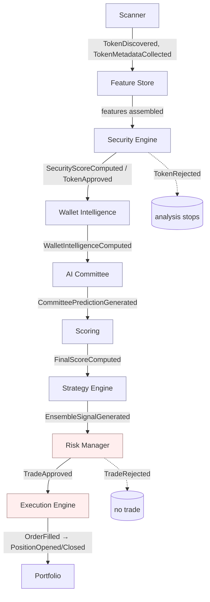
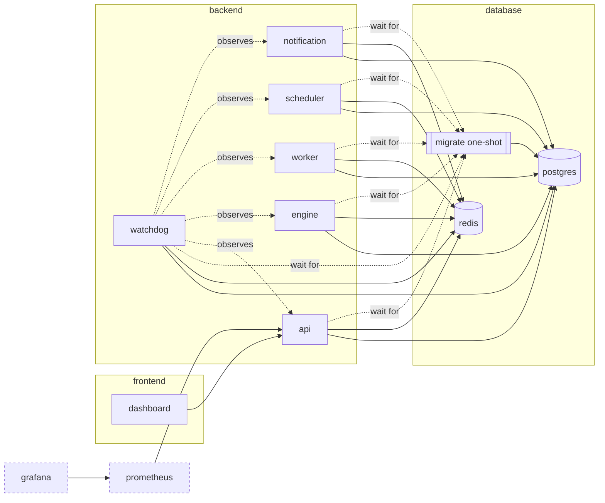
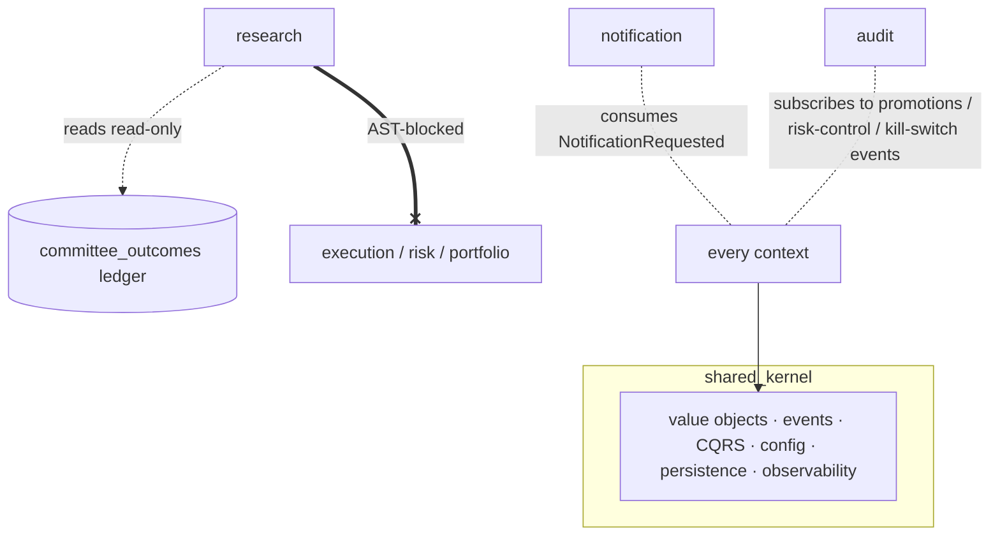

# Architecture maps

The authoritative narrative reference is [`../hades.md`](../hades.md). This document holds
the **maps** — the pipeline flow, the service topology, the context-dependency graph and the
event map — plus the Architecture Decision Records. Everything here is traced to source
(event names come from each context's `domain/events.py`).

---

## 1. Decision pipeline (data flow)

Data flows one way. The scoring/AI layer only ever produces probabilities; **only the Risk
Manager authorises a trade**, and only the Execution Engine knows paper vs. live.

- **Quantify (blue):** Scanner → … → Strategy Engine. Produce evidence; never decide.
- **Decide (red):** Risk Manager (sole trade authoriser) → Execution Engine (sole
  mode-aware component).

## 2. Service topology (Docker Compose)

Three network tiers isolate the presentation, application and data layers. Data-store
ports are unpublished in production; observability admin UIs bind to localhost.

Startup order: `postgres`/`redis` healthy → `migrate` runs `alembic upgrade head` and exits
→ every app service starts (gated on `migrate` completing) → `dashboard` after `api`.

**Where the contexts run:** the Scanner, AI Committee, Strategy, Research, Audit and
Performance runtimes live in the **worker**; the decision loop in the **engine**; REST/WS in
the **api**; Discord delivery in **notification**; periodic jobs (backups, cleanup) in
**scheduler**; liveness/health/recovery in **watchdog**.

## 3. Context dependency & isolation map

Contexts never import each other's internals — they communicate through domain events on
the bus. Two isolation rules are **structurally enforced by tests**:

- **Research Lab isolation (verified):** `tests/test_research_isolation.py` AST-parses every
  file under `contexts/research` and fails the build if it imports `execution`, `risk` or
  `portfolio`; it also asserts promotion payloads carry no order/size and require
  `manual_approved`.
- **Single trade authoriser (verified):** `TradeApproved` is constructed in exactly one
  place — `risk/application/manager.py`.

## 4. Event map

Every context owns its events (`contexts/<name>/domain/events.py`). The bus is an
`EventBus` port with an in-memory transport (single process) and a Redis Streams transport
(per-service consumer groups; every service sees every event; at-least-once, so handlers are
idempotent).

| Context | Key published events | Primary consumers |
|---|---|---|
| **scanner** | `TokenDiscovered`, `PoolDiscovered`, `TokenMetadataCollected`, `SignificantChangeDetected`, `RpcEndpointSwitched`, `SourceHealthChanged`, `DataQualityAnomalyDetected` | Feature Store, Security Engine, Watchdog |
| **security** | `SecurityScoreComputed`, `TokenApproved`, `TokenRejected`, `ContractRiskDetected`, `LiquidityWarning`, `ClusterFound`, `DeveloperRisk` | Wallet Intelligence, AI Committee, Audit |
| **intelligence** (wallet KB) | `WalletProfileComputed`, `WalletIntelligenceComputed`, `SmartMoneyDetected`, `ReputationUpdated`, `ClusterCreated`, `FundingRelationshipFound`, … | AI Committee |
| **wallet** | `WalletScoreComputed` | Scoring, AI Committee |
| **learning** (AI Committee) | `CommitteePredictionGenerated`, `InferenceCompleted`, `ConfidenceCalculated`, `ModelTrained`/`Validated`/`Promoted`/`Rejected`, `ModelDriftDetected` | Scoring, Strategy, Audit, Monitoring |
| **scoring** | `FinalScoreComputed` | Strategy Engine |
| **strategy** | `EnsembleSignalGenerated`, `SignalGenerated`/`Rejected`, `StrategyLoaded`/`Disabled`/`Error`, `ShadowActivated`, `StrategyPromoted`, `WeightUpdated` | Risk Manager, Audit |
| **risk** | `TradeApproved`, `TradeRejected`, `RiskReduced`, `KillSwitch*`, `CircuitBreaker*`, `EmergencyMode*`, `Drawdown/ExposureLimitBreached`, `RiskControlCommandIssued` | Execution, Portfolio, Audit, Notification |
| **execution** | `OrderSubmitted`, `OrderFilled`, `OrderFailed`, `TradingModeChanged` | Portfolio, Notification, Audit |
| **portfolio** | `PositionOpened`, `PositionUpdated`, `TrailingStopAdjusted`, `PositionClosed`, `CapitalCommitted`/`Released`, `PortfolioUpdated` | Risk Manager, Monitoring, Notification |
| **notification** | `NotificationRequested` (consumed only by the Notification Service) | Notification Service → Discord |

Cross-cutting consumers: **Audit** records promotions, weight changes, kill-switch /
circuit-breaker / emergency transitions and risk-control commands generically from the event
envelope; **Monitoring/Performance** derives throughput/latency entirely from existing events
(no hot-path intrusion); the **Watchdog** reacts to health/source events and can escalate to
Emergency Mode.

---

## 5. Architecture Decision Records (ADRs)

ADRs are numbered `NNNN-title.md` here as decisions are formalised. The Phase 1/2 baseline is
documented in `hades.md` (§6/§6a).

Realised decisions (candidates to formalise retroactively):

- **Postgres schema baseline** — 57 tables across 7 migrations from `Base.metadata`
  (`alembic/versions/0001_initial_schema.py` onward); UUIDv7 pks + timestamps everywhere.
- **Redis Streams event bus** with **per-service consumer groups** (every service sees every
  event) and an `EventRegistry` for cross-boundary rebuild.
- **Background-service liveness** via heartbeat files + Docker healthchecks (`--role`), the
  watchdog verifying freshness and driving bounded auto-recovery.
- **Paper↔live switch** — DB authority (`system_configuration`) ANDed with the hard env
  gate; audited, event-driven, notification-announced; a switch to LIVE additionally
  requires an authenticated operator.
- **Turnkey deployment** — a one-shot `migrate` service gates all app services, so
  `docker compose up -d` applies the schema with no manual step.

Candidate ADRs for Hades v2 / pre-LIVE (see `PRODUCTION_READINESS.md`):

- Postgres-backed event store + `UnitOfWork` (replace the in-memory fallback) — **H1**.
- Durable execution ledger (order/transaction stores) + persisted open positions — **H2/H3**.
- WebSocket authentication contract (server + dashboard) — **H5**.
- Model registry format and promotion protocol (already implemented; formalise as an ADR).
